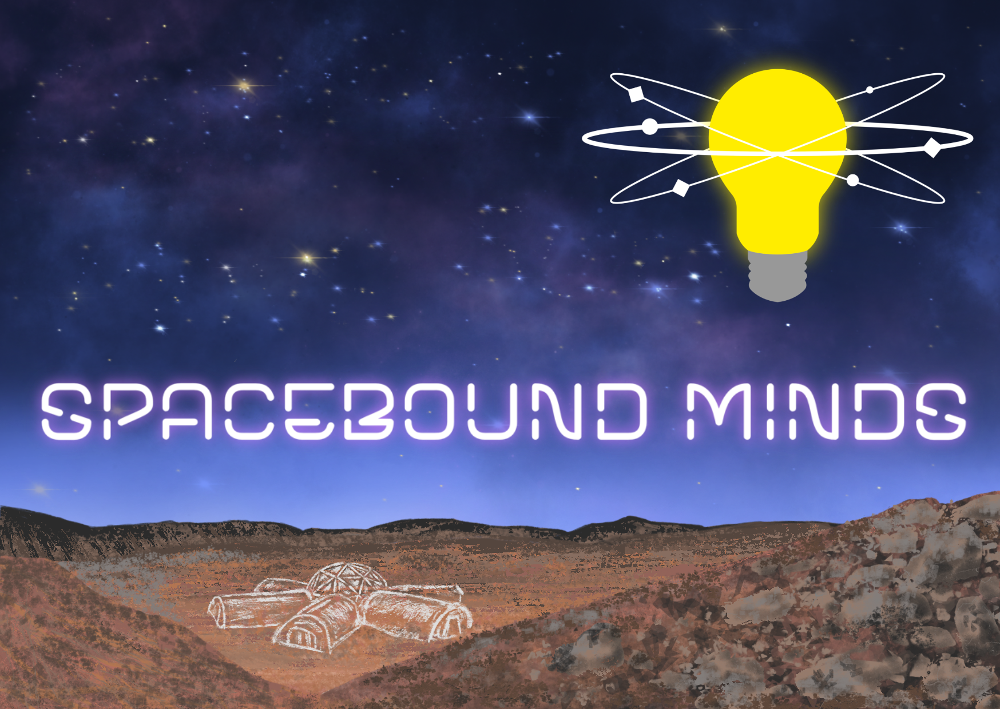

<!-- This is the home page for our online resources. Maybe some links on general mental health could go here?  -->

# Welcome back!

During SpaceBound Minds, you joined scientists in building a space station where people of all ages can keep their brains and bodies healthy. Hopefully you gained a good idea of how everyday activities can shape our mental and physical wellbeing, all while building and decorating the rooms of a model space station. Now that the hard work is done, you get to enjoy your new happy place!

In this space, you will find resources if you want to learn more about mental health. 

## General mental health

The [health for kids](https://www.healthforkids.co.uk/) website has information for young people and grownups on different elements of health, feelings, illness, and getting help.

## Sleep

<!-- ... alternatively, add the theme-specific resources to [another page](another-page.md). -->
<!-- We could also use more pages to create spaces for resources targeting children and parents. -->

NHS page on sleep problems: https://www.nhs.uk/every-mind-matters/mental-health-issues/sleep/ 

Health for kids on sleep: https://www.healthforkids.co.uk/staying-healthy/sleep/

# Physical activity

# Social contact

# Thank you for attending our workshop!

