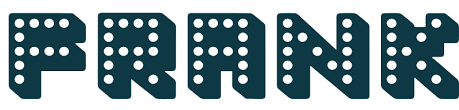
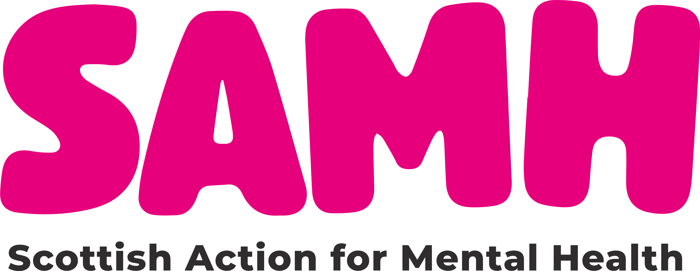
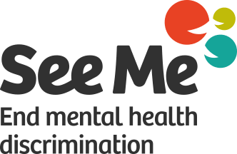

<!-- This is the home page for our online resources. Maybe some links on general mental health could go here?  -->

# Welcome back, astronauts!

In **Spacebound Minds**, you tested out what life could be like on another planet. We learned that we need lots more than just food, water and air to live a happy and healthy life. Our scientists shared that sleeping well, being active and socialising with friends and family were also important for looking after our well-being. 

Armed with all this new knowledge, we built and decorated a model of what our space station *could* look like, with lots of ways for people of all ages to stay happy and healthy. Now that all the hard work is done, it's time for you to buckle up and get ready for launch! 

Watch the tour of the whole space station, and see if you can spot your own happy place: 

> If the video isn't available yet, check back in a few weeks!

Check out the links at the top of this page to find out more about mental health and wellbeing, and what you can do if you need support.

<!-- It would be great to have tabs at the top of the page that link to each of the subheadings -->

## General mental health

The [health for kids](https://www.healthforkids.co.uk/) website has information for young people and grownups on different elements of health, feelings, illness, and getting help.

## Sleep

[Link to the sleep page](./sleep.html).

[NHS page on sleep problems](https://www.nhs.uk/every-mind-matters/mental-health-issues/sleep/)

[Health for kids on sleep](https://www.healthforkids.co.uk/staying-healthy/sleep/)

## Physical activity

[Link to the physical activity page](./physical-activity.html).

## Social contact

[Link to the social contact page](./social-contact.html).

# Support

[Link to the support page](./support.html).

**If you or someone else is in danger, call 999 or go to your nearest A&E.** 

**For urgent help with your mental health, call NHS 24 by dialling 111 or [visit the 111 website](https://111.nhs.uk/).**

The [NHS website on mental health](https://www.nhs.uk/mental-health/) is a useful place to start for information and support. There is a dedicated page on [mental health for children, teenagers and young adults](https://www.nhs.uk/mental-health/children-and-young-adults/) with advice for [teens](https://www.nhs.uk/mental-health/children-and-young-adults/help-for-teenagers-young-adults-and-students/) and [grown-ups](https://www.nhs.uk/mental-health/children-and-young-adults/advice-for-parents/). You can also check out the information below:

## For children and young people

Some days can feel extra hard, but you're not alone. It might feel scary or silly to talk about how you're feeling, but it's really important. Try and talk to an adult you trust - maybe someone in your family, a doctor, or a teacher at school. They can help you work out your worries and arrange for you to get support if you need it.

You can get help 24/7 from the options below. These are free and *confidential*, which means that what you say won't be shared with other people - **unless they think you or someone else is in danger**.

* Call **[Childline](https://www.childline.org.uk/)** on **0800 1111**. It's free, and won't show up on your phone bill. You can also send an email or chat with a volunteer online.

* Text **THEMIX** to **85258**. **[The Mix](https://www.themix.org.uk/)** also has a webchat, support groups and short-term counselling.

* Talk to **[FRANK](https://www.talktofrank.com/)** by calling **0300 123 6600**. You can also text FRANK on **82111** for confidential support, advice and information about drugs, their effects and the law.
---

You can find more useful contacts on the **[Mind website](https://www.mind.org.uk/for-young-people/how-to-get-help-and-support/useful-contacts/)**. They have resources for all kinds of people, including LGBTQIA+ people, young women, young men and people of colour.

## For grown-ups

For free and anonymous support 24/7:

* Call **[Samaritans](https://www.samaritans.org/scotland/)** on **116 123** or contact them by email or [online](https://www.samaritans.org/scotland/how-we-can-help/contact-samaritan/).

* Text **SHOUT** to **85258**. You can visit the [SHOUT website](https://giveusashout.org/) for more advice on your mental health and to find support online.

---

* The [Mind website](https://www.mind.org.uk/information-support/) has more resources on finding support for mental health problems. 

 
* [SAMH](https://www.samh.org.uk/find-help) offers advice and support services (some which accept self-referrals) for anyone aged 16 or over, living in Scotland. 

* [See Me Scotland](https://www.seemescotland.org/) have a [National Signposting Directory](https://www.seemescotland.org/media/9721/see-me-national-signposting-directory-final_rl_170119.pdf) which covers services available in Scotland, England and Wales.

# Thank you for attending our workshop!

