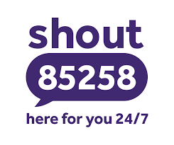

**If you or someone else is in danger, call 999 or go to your nearest A&E.** 

**For urgent help with your mental health, call NHS 24 by dialling 111 or [visit the 111 website](https://111.nhs.uk/).**

 

Check out the [Health for Kids](https://www.healthforkids.co.uk/) website for advice on coping with hard feelings and ways to get help. There's lots of information for young people and grown-ups on all kinds of health topics!

The [NHS website on mental health](https://www.nhs.uk/mental-health/) has a dedicated page for children, teenagers and young adults with advice for [teens](https://www.nhs.uk/mental-health/children-and-young-adults/help-for-teenagers-young-adults-and-students/) and [grown-ups](https://www.nhs.uk/mental-health/children-and-young-adults/advice-for-parents/).

---

## For children and young people

Some days can feel extra hard, but you're not alone. It might feel scary or silly to talk about how you're feeling, but it's really important. Try and talk to an adult you trust - maybe someone in your family, a doctor, or a teacher at school. They can help you work out your worries and arrange for you to get support if you need it.

You can get help 24/7 from the options below. These are free and *confidential*, which means that what you say won't be shared with other people - **unless they think you or someone else is in danger**.

Call **[Childline](https://www.childline.org.uk/)** on **0800 1111**. It's free, and won't show up on your phone bill. You can also send an email or chat with a volunteer online.

Text **THEMIX** to **85258**. **[The Mix](https://www.themix.org.uk/)** also has a webchat, support groups and short-term counselling.

Talk to **[FRANK](https://www.talktofrank.com/)** by calling **0300 123 6600**. You can also text FRANK on **82111** for confidential support, advice and information about drugs, their effects and the law.

You can find more useful contacts on the **[Mind website](https://www.mind.org.uk/for-young-people/how-to-get-help-and-support/useful-contacts/)**. They have resources for all kinds of people, including LGBTQIA+ people, young women, young men and people of colour.

---

## For grown-ups

For free and anonymous support 24/7:

Call **[Samaritans](https://www.samaritans.org/scotland/)** on **116 123** or contact them by email or [online](https://www.samaritans.org/scotland/how-we-can-help/contact-samaritan/).

Text **SHOUT** to **85258**. You can visit the [SHOUT website](https://giveusashout.org/) for more advice on your mental health and to find support online.

The [Mind website](https://www.mind.org.uk/information-support/) has more resources on finding support for mental health problems. 

 
[SAMH](https://www.samh.org.uk/find-help) offers advice and support services (some which accept self-referrals) for anyone aged 16 or over, living in Scotland. 

[See Me Scotland](https://www.seemescotland.org/) have a [National Signposting Directory](https://www.seemescotland.org/media/9721/see-me-national-signposting-directory-final_rl_170119.pdf) which covers services available in Scotland, England and Wales.
